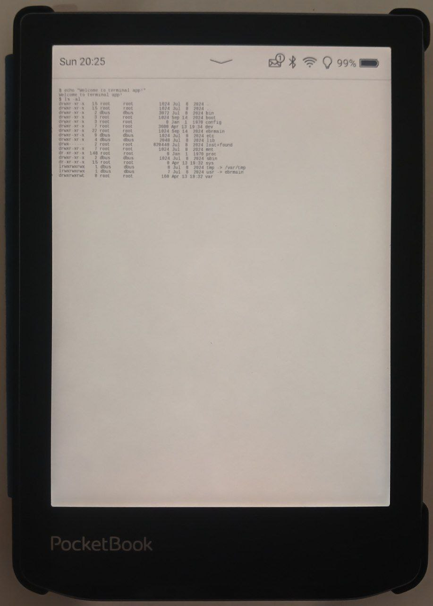
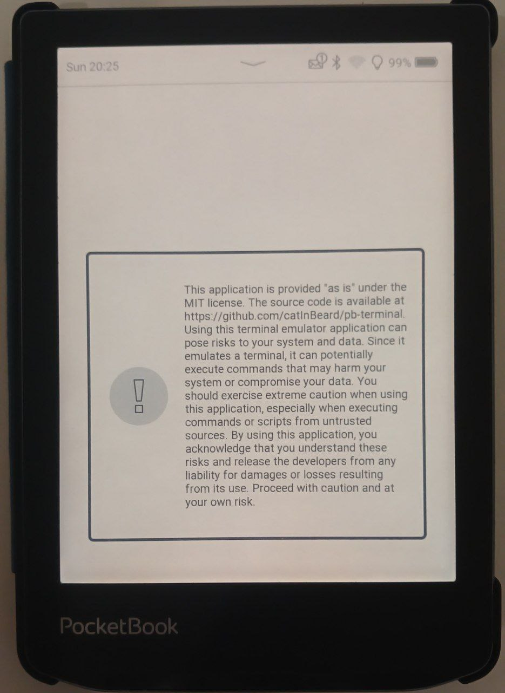
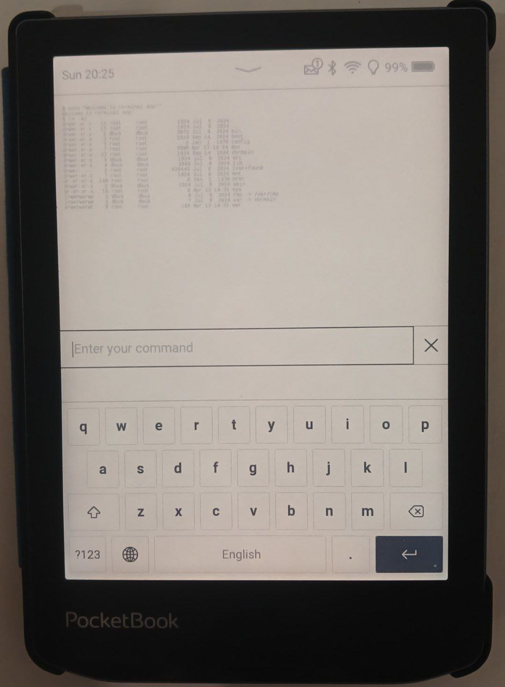

# Terminal Emulator for PocketBook
A terminal emulator for PocketBook e-readers running on Linux.

## Description
A terminal emulator for PocketBook, written in Go. It uses the libinkview library implementation by dennwc: https://github.com/dennwc/inkview. The project is built using the Docker image from Skeeve: https://github.com/Skeeve/SDK_6.3.0.

## Installation
To install the application, connect your e-reader to your computer via a cable and copy the [release](https://github.com/CatInBeard/pb-terminal/releases/) file to the `applications` folder. On Linux, you can build the application from source using the command `make build` and automatically install it on the connected e-reader using the command `make install`.

## Warning

Using a terminal emulator on an e-reader can pose risks. The terminal provides access to system files and commands that can potentially harm your e-reader or disrupt its operation. If you are not familiar with the command line and do not know what you are doing, you may accidentally:
* Delete important system files or settings
* Change system configuration, leading to unstable operation or crashes
* Install unverified or malicious software
* Access sensitive information or settings
Please use the terminal emulator with caution and only if you are confident in your actions. If you are unsure, it is better not to use the terminal or seek help from an experienced user.

## Working with the Terminal
By default, the working directory will be `/`. User files are located in `/mnt/ext1`, if there is a memory card, then `/mnt/ext2`. Currently, it is not possible to obtain root privileges, and the `reader` user will be used. The e-reader has busybox installed, and the terminal uses `/bin/sh`.

### FAQ
* Q: How to install the terminal emulator on PocketBook?  
A: To install the application, connect your e-reader to your computer via a cable and copy the release(https://github.com/CatInBeard/pb-terminal/releases/) file to the applications folder. On Linux, you can build the application from source using the command make build and automatically install it on the connected e-reader using the command make install.
* Q: What user is used in the terminal emulator?  
A: Currently, the reader user is used.
* Q: Can I get root privileges in the terminal emulator?  
A: No, currently it is not possible to obtain root privileges.
* Q: Where are the user files located in the terminal emulator?  
A: User files are located in /mnt/ext1, if there is a memory card, then /mnt/ext2.
* Q: What command interpreter is used in the terminal emulator?  
A: The /bin/sh command interpreter is used in the terminal emulator.
* Q: What is busybox and why is it used in the terminal emulator?  
A: Busybox is a set of utilities that provide basic command-line functions. It is used in the terminal emulator because it is lightweight and efficient.
* Q: How to update the terminal emulator to the latest version?  
A: To update the terminal emulator, simply replace the existing application file with the new one downloaded from release(https://github.com/CatInBeard/pb-terminal/releases/). This can be done by connecting the e-reader to your computer and copying the new file to the applications folder, replacing the existing file. This is similar to the initial installation process of the application.